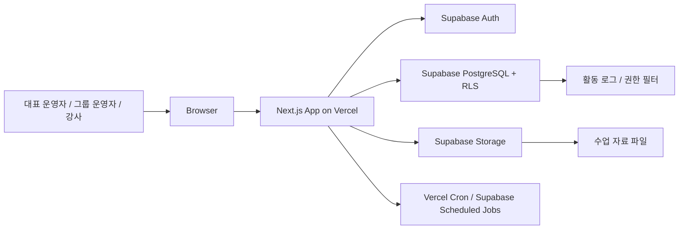

# DURE Architecture

이 문서는 `prd.md`와 `context.md`를 기준으로 DURE MVP의 기술 구조를 정의한다. DURE는 여러 운영 단위의 수업, 참여자, 강사, 일정, 자료, 출석 기록을 한 워크스페이스 안에서 관리하는 웹 서비스다.

이 문서는 시스템 구성, 데이터 모델, 권한 설계, 저장소, 배포, 보안 기준을 다룬다. 페이지별 query/action의 상세 입력과 출력 계약은 `docs/api-spec.md`에서 관리한다.

## 1. 설계 원칙

- 워크스페이스를 최상위 테넌트 경계로 둔다.
- 참여자는 로그인 사용자가 아니라 운영 대상 데이터로만 다룬다.
- 대표 운영자, 그룹 운영자, 강사의 권한 차이를 DB Row Level Security와 서버 로직 양쪽에서 검증한다.
- 수업, 회차, 출석, 수업 메모는 삭제보다 상태 변경과 기록 보존을 우선한다.
- MVP에서는 외부 알림, 보고서 자동 생성, 자료 미리보기, 정산/계약 도메인을 제외한다.
- 복잡한 권한 판정은 클라이언트에서 신뢰하지 않고 Supabase/PostgreSQL 함수 또는 Next.js 서버 액션/API에서 처리한다.

## 2. 전체 시스템 구조



### 구성 요소

| 영역 | 책임 |
| --- | --- |
| Next.js | 화면 라우팅, 서버 컴포넌트, 서버 액션/API, 폼 검증, Supabase 호출 |
| Supabase Auth | 사용자 가입/로그인, 초대 링크 수락 후 사용자 식별 |
| PostgreSQL | 워크스페이스, 그룹, 수업, 참여자, 회차, 출석, 메모, 권한 데이터 저장 |
| Supabase RLS | 워크스페이스 격리, 역할별 조회/수정 제한 |
| Supabase Storage | 수업 자료 원본 파일 저장 |
| Vercel | Next.js 배포, 환경변수 관리, 서버리스 실행 |
| Scheduled Jobs | 수업 상태 자동 전환, 만료 초대 정리 같은 주기 작업 |

## 3. 기술 스택

| 계층 | 선택 | 이유 |
| --- | --- | --- |
| Frontend | Next.js App Router, React, TypeScript | 인증 기반 대시보드와 서버 데이터 로딩에 적합 |
| Styling | Tailwind CSS, shadcn/ui 권장 | 운영 도구 UI를 빠르게 일관되게 구성 |
| Backend | Next.js Server Actions, Route Handlers | 별도 백엔드 없이 Supabase와 밀접하게 연동 |
| Auth | Supabase Auth | PostgreSQL RLS와 사용자 식별을 자연스럽게 연결 |
| Database | Supabase PostgreSQL | 관계형 도메인, 권한 쿼리, RLS에 적합 |
| File Storage | Supabase Storage | 자료 파일 접근 정책을 DB 권한과 맞추기 쉬움 |
| Deployment | Vercel | Next.js 배포 표준에 가깝고 환경변수 관리가 단순함 |
| Validation | Zod 권장 | 폼 입력, API payload, 서버 액션 검증 |
| Date/Time | date-fns 또는 Luxon 권장 | 워크스페이스 기준 시간대와 반복 회차 생성 처리 |

## 4. 프론트엔드 구조

Next.js App Router를 기준으로 역할별 화면을 분리한다.

```text
app/
  (auth)/
    login/
    accept-invite/
  workspaces/[workspaceId]/
    (dashboard)/
      home/
      calendar/
      members/
      manage/
        groups/
        courses/
        participants/
      courses/[courseId]/
        home/
        materials/
        participants/
    instructor/
      courses/
      courses/[courseId]/
        home/
        materials/
        attendance/
```

### 화면 책임

- `home`: 운영 중인 수업 카드 목록, 수업 상세 진입.
- `calendar`: 수업 회차와 일반 일정의 월간 캘린더.
- `members`: 사용자 초대와 권한 설정. 대표 운영자 전용.
- `manage/groups`: 그룹 생성, 수정, 비활성화, 삭제.
- `manage/courses`: 수업 생성, 그룹/강사/참여자 배정, 수업 상태 관리.
- `manage/participants`: 참여자 마스터 생성, 그룹 배정, 검색/필터.
- `courses/[courseId]`: 운영자용 수업 상세.
- `instructor/*`: 강사용 콘솔. 담당 수업만 표시한다.

### 클라이언트/서버 경계

- 목록, 상세, 권한 필터가 필요한 데이터는 서버 컴포넌트에서 조회한다.
- 생성/수정/삭제성 동작은 서버 액션 또는 Route Handler에서 처리한다.
- 클라이언트 컴포넌트는 폼 상태, 모달, 캘린더 인터랙션, 파일 선택 같은 UI 상태에 집중한다.
- 권한에 따른 버튼 노출은 UX 보조 장치일 뿐이며, 실제 권한은 서버와 RLS에서 다시 검증한다.

## 5. 백엔드 구조

MVP에서는 별도 API 서버를 두지 않고 Next.js 서버 계층을 백엔드로 사용한다.

### 서버 모듈 권장 구조

```text
src/
  lib/
    supabase/
      client.ts
      server.ts
      admin.ts
    auth/
      require-user.ts
      require-workspace-role.ts
    permissions/
      groups.ts
      courses.ts
      materials.ts
    validators/
      course.ts
      participant.ts
      material.ts
  services/
    workspaces.ts
    groups.ts
    courses.ts
    sessions.ts
    participants.ts
    materials.ts
    attendance.ts
    invites.ts
    activity.ts
```

### 처리 원칙

- 일반 CRUD는 Supabase client와 RLS를 통해 처리한다.
- 여러 테이블을 함께 변경하는 작업은 PostgreSQL RPC 또는 서버 트랜잭션 함수로 묶는다.
- 서비스 함수는 현재 사용자, 워크스페이스, 역할을 명시적으로 입력받는다.
- Supabase service role key는 서버 전용 모듈에서만 사용하고 클라이언트 번들에 노출하지 않는다.
- 페이지는 Supabase 업무 테이블을 직접 조회하지 않고 `docs/api-spec.md`의 query/action 계약을 호출한다.
- 최근 활동, 자료 다운로드, 수업 참여자 범위 변경처럼 대상별 권한 판정이 필요한 기능은 전용 서비스 함수에서 권한 필터를 수행하고 DTO만 반환한다.

## 6. 데이터 모델

워크스페이스 하위 업무 테이블은 기본적으로 `workspace_id`, `created_at`, `updated_at`을 가진다. 삭제가 기록 보존에 영향을 주는 도메인은 `deleted_at` 또는 상태 필드를 우선 사용한다.

### 핵심 테이블

| 테이블 | 주요 필드 | 설명 |
| --- | --- | --- |
| `workspaces` | `id`, `name`, `timezone`, `created_by` | 최상위 운영 공간 |
| `workspace_members` | `workspace_id`, `user_id`, `email`, `display_name`, `role`, `status` | 대표 운영자, 그룹 운영자, 강사 멤버십. 초대 대기 사용자는 `user_id`가 비어 있을 수 있음 |
| `workspace_member_groups` | `workspace_id`, `member_id`, `group_id` | 그룹 운영자의 접근 그룹 |
| `groups` | `workspace_id`, `name`, `description`, `status`, `deleted_at` | 권한 스코프이자 운영 단위 |
| `participants` | `workspace_id`, `name`, `memo`, `status`, `created_by`, `deleted_at` | 로그인하지 않는 참여자 마스터 |
| `participant_groups` | `workspace_id`, `participant_id`, `group_id`, `status` | 참여자와 그룹의 N:M 관계 |
| `courses` | `workspace_id`, `name`, `status`, `starts_on`, `ends_on`, `instructor_member_id`, `card_color`, `banner_url` | 수업 기본 정보 |
| `course_recurrence_rules` | `workspace_id`, `course_id`, `repeat_weekdays`, `starts_at`, `ends_at`, `ends_on`, `session_count` | 회차 생성을 위한 반복 조건 |
| `course_groups` | `workspace_id`, `course_id`, `group_id`, `group_name_snapshot` | 수업과 그룹의 N:M 관계 |
| `course_participants` | `workspace_id`, `course_id`, `participant_id`, `status`, `participant_name_snapshot`, `assigned_at` | 수업 참여자 배정 |
| `course_participant_groups` | `workspace_id`, `course_participant_id`, `group_id`, `group_name_snapshot` | 수업 내 참여 그룹 목록 |
| `course_sessions` | `workspace_id`, `course_id`, `session_no`, `date`, `starts_at`, `ends_at`, `type`, `visibility_status`, `rollup_status`, `progress_status` | 회차 |
| `materials` | `workspace_id`, `course_id`, `title`, `description`, `storage_path`, `original_filename`, `mime_type`, `size_bytes`, `uploaded_by`, `upload_status`, `review_status`, `visibility_scope` | 수업 자료 메타데이터. `visibility_scope`는 `material_visibility_scope` enum 사용 |
| `material_groups` | `workspace_id`, `material_id`, `group_id` | `visibility_scope = selected_groups`일 때 자료 공개 그룹 목록 |
| `general_schedule_items` | `workspace_id`, `title`, `date`, `starts_at`, `ends_at`, `description`, `color`, `created_by` | 일반 일정 |
| `general_schedule_item_groups` | `workspace_id`, `schedule_item_id`, `group_id` | 일반 일정 공개 그룹 목록. 항상 1개 이상 필요 |
| `attendance_records` | `workspace_id`, `session_id`, `participant_id`, `participant_name_snapshot`, `status`, `note`, `updated_by` | 출석과 특이사항 |
| `class_memos` | `workspace_id`, `session_id`, `content`, `updated_by` | 회차별 수업 메모 |
| `invites` | `workspace_id`, `member_id`, `token_hash`, `role`, `expires_at`, `accepted_at`, `created_by` | 초대 링크. `member_id`는 초대 대기 멤버십을 가리킴 |
| `invite_groups` | `workspace_id`, `invite_id`, `group_id` | 그룹 운영자 초대 시 접근 그룹 |
| `invite_courses` | `workspace_id`, `invite_id`, `course_id` | 강사 초대 시 담당 수업 |
| `activity_logs` | `workspace_id`, `actor_member_id`, `event_type`, `target_type`, `target_id`, `metadata` | 헤더 최근 활동 |

### 권장 enum

- `workspace_role`: `owner_admin`, `group_admin`, `instructor`
- `member_status`: `active`, `invited`, `disabled`, `removed`
- `group_status`: `active`, `inactive`
- `participant_status`: `active`, `inactive`, `deleted`
- `participant_group_status`: `active`, `removed`
- `course_participant_status`: `active`, `excluded`
- `course_status`: `planned`, `in_progress`, `completed`
- `session_type`: `regular`, `makeup`, `special`, `practice`
- `session_visibility_status`: `visible`, `hidden`
- `session_rollup_status`: `included`, `excluded`
- `session_progress_status`: `scheduled`, `cancelled`
- `material_upload_status`: `uploading`, `uploaded`, `failed`
- `material_review_status`: `pending`, `reviewed`
- `attendance_status`: `present`, `partial`, `absent`
- `material_visibility_scope`: `all_course_groups`, `selected_groups`

### 주요 관계

- 워크스페이스는 여러 그룹, 참여자, 수업, 멤버를 가진다.
- 그룹은 여러 참여자와 여러 수업에 연결된다.
- 참여자는 여러 그룹과 여러 수업에 속할 수 있다.
- 수업은 하나 이상의 그룹에 연결된다.
- 수업은 MVP에서 담당 강사를 최대 1명 가진다. 담당 강사는 없을 수 있다.
- 수업 생성 시 입력한 반복 조건은 `course_recurrence_rules`에 저장하고, 생성된 실제 회차는 `course_sessions`에 저장한다.
- 수업-참여자 배정은 참여자의 수업 내 참여 그룹 목록을 별도 테이블로 가진다.
- 회차는 수업에 속하고, 출석 기록과 수업 메모는 회차에 속한다.
- 자료는 공개 범위를 가지고, 일반 일정은 공개 그룹 목록을 가진다.

### 초대 대기 사용자 모델

PRD는 초대 대기 강사도 수업 담당 강사로 배정할 수 있어야 한다. 따라서 초대 링크만 만들고 사용자가 가입하기 전에도 `workspace_members`에 `status = invited`, `user_id = null`, `email`이 있는 멤버십 placeholder를 만든다.

- 강사 초대 시 `workspace_members` placeholder를 만들고 `courses.instructor_member_id`에 배정할 수 있다.
- 초대 수락 시 Supabase Auth 사용자 ID를 기존 placeholder의 `user_id`에 연결하고 `status = active`로 바꾼다.
- 그룹 운영자 초대도 같은 방식으로 placeholder를 만들고 `workspace_member_groups`를 미리 연결한다.
- 이미 가입한 사용자를 초대하는 경우에는 기존 `user_id`와 멤버십을 연결해 즉시 `active`로 전환할 수 있다.
- `invites.member_id`는 해당 초대가 활성화할 placeholder 멤버십을 가리킨다. 초대 수락 시 새 멤버십을 만들지 않고 기존 placeholder를 활성화한다.

### 테넌트 키 중복 저장

RLS 정책과 인덱스를 단순하게 유지하기 위해 조인 테이블에도 `workspace_id`를 중복 저장한다. `workspace_id`는 부모 레코드와 일치해야 하며, 이 불변식은 FK, composite FK, 또는 DB 트리거로 강제한다.

### 공개 범위 표현

수업 자료는 “전체 연결 그룹 공개”와 “선택 그룹 공개”를 구분해야 한다. 조인 테이블이 비어 있는 상태를 전체 공개로 해석하면 데이터 누락과 의도적 전체 공개를 구분하기 어렵다.

- `visibility_scope = all_course_groups`: 수업 자료는 해당 수업의 모든 연결 그룹에 공개한다. 이때 `material_groups`는 비워둔다.
- `visibility_scope = selected_groups`: `material_groups`에 저장된 그룹에만 공개한다.
- `selected_groups`일 때 공개 그룹 목록은 1개 이상이어야 한다.
- 일반 일정은 연결 수업이 없으므로 전체 연결 그룹이라는 개념을 쓰지 않는다. `general_schedule_item_groups`에 공개 그룹을 항상 1개 이상 저장하고, 대표 운영자가 전체 공개 일정을 만들 때는 현재 활성 그룹 전체를 명시적으로 연결한다.

### 주요 DB 불변 규칙

- `course_recurrence_rules.ends_on`과 `course_recurrence_rules.session_count`는 둘 중 하나만 값이 있어야 한다.
- `course_recurrence_rules.repeat_weekdays`는 1개 이상의 요일을 가져야 한다. 단발성 수업도 `session_count = 1`인 반복 규칙으로 저장한다.
- `course_groups`는 수업당 1개 이상이어야 한다.
- `course_participant_groups.group_id`는 해당 수업의 `course_groups.group_id` 중 하나여야 한다.
- `course_participants`는 같은 `course_id`, `participant_id` 조합에 대해 활성 배정을 1개만 허용한다.
- `materials.visibility_scope = selected_groups`이면 `material_groups`가 1개 이상이어야 하고, 각 그룹은 해당 수업의 연결 그룹이어야 한다.
- `general_schedule_item_groups`는 일반 일정당 1개 이상이어야 한다.
- `attendance_records`는 같은 `session_id`, `participant_id` 조합에 대해 1개만 허용한다.

## 7. API 구조

Next.js Server Actions를 기본으로 사용하고, 파일 업로드/다운로드와 외부 콜백처럼 HTTP 엔드포인트가 필요한 경우 Route Handler를 사용한다.

### 서버 액션/RPC 후보

| 기능 | 입력 | 출력 | 처리 |
| --- | --- | --- | --- |
| 워크스페이스 생성 | `name`, `timezone` | `workspace` | 생성자를 대표 운영자로 등록 |
| 그룹 생성/수정 | 그룹 필드 | `group` | 대표 운영자 권한 확인 |
| 참여자 생성 | `name`, `memo`, `groupIds` | `participant` | 그룹 내 이름 중복 시 suffix 적용 |
| 수업 생성 | 기본 정보, 반복 조건, `groupIds`, `participantAssignments`, `instructorMemberId` | `course`, `sessions` | 수업/그룹/회차/참여자/수업 내 참여 그룹 배정을 트랜잭션으로 생성 |
| 수업 참여자 변경 | `courseId`, `participantId`, `assignmentGroupIds`, `action` | `courseParticipant` | `assignmentGroupIds`는 수업 내 참여 그룹 목록이며, 그룹 운영자는 자기 그룹 범위만 변경 |
| 자료 업로드 준비 | `courseId`, 파일 메타데이터, 공개 그룹 | signed upload URL 또는 storage path | 확장자/크기/권한 검증 |
| 자료 메타데이터 저장 | 파일 메타데이터, `visibilityScope`, 공개 그룹 | `material` | 상태를 `pending`으로 저장 |
| 자료 확인 상태 변경 | `materialId`, `review_status` | `material` | 대표/권한 있는 그룹 운영자만 가능 |
| 출석 저장 | `sessionId`, records[] | 저장된 records | 담당 강사 또는 권한 있는 운영자만 가능 |
| 수업 메모 저장 | `sessionId`, `content` | `class_memo` | 담당 강사 또는 권한 있는 운영자만 가능 |
| 초대 링크 생성 | `email`, `role`, 접근 그룹/수업 | invite URL | 대표 운영자만 가능, placeholder 멤버십 생성, 7일 만료 |
| 초대 수락 | token | `workspace_member` | 토큰 검증 후 placeholder 멤버십을 Auth 사용자와 연결 |
| 최근 활동 조회 | `workspaceId`, limit | activity[] | 현재 권한으로 볼 수 있는 이벤트만 반환 |

### Route Handler 후보

| 경로 | 메서드 | 목적 |
| --- | --- | --- |
| `/api/materials/upload-url` | `POST` | Supabase Storage 업로드용 signed URL 생성 |
| `/api/materials/[materialId]/download` | `GET` | 권한 검증 후 signed download URL 발급 |
| `/api/invites/[token]/accept` | `POST` | 초대 링크 수락 |
| `/api/cron/complete-courses` | `POST` | 마지막 유효 회차가 지난 수업 상태 자동 완료 |

API 응답은 도메인 객체 전체를 무조건 반환하지 않고 화면에 필요한 projection을 반환한다. 예를 들어 수업 목록은 수업명, 상태, 연결 그룹, 담당 강사, 참여자 수만 반환한다.

## 8. 인증/권한 설계

### 인증

- Supabase Auth를 사용한다.
- 로그인 사용자는 `auth.users`에 존재한다.
- 서비스 권한은 `workspace_members`에 저장한다.
- 초대 대기 멤버십은 `workspace_members.user_id = null`, `status = invited` 상태로 존재할 수 있다.
- 사용자는 여러 워크스페이스에 속할 수 있다.
- 현재 워크스페이스는 URL 세그먼트, 세션 상태, 또는 사용자 기본 선택값으로 결정한다.

### 역할

| 역할 | 권한 범위 |
| --- | --- |
| 대표 운영자 | 워크스페이스 전체 데이터 접근, 그룹/수업/참여자/사용자 권한 관리 |
| 그룹 운영자 | 지정된 그룹 범위의 수업, 참여자, 자료, 일정, 기록 접근 |
| 강사 | 직접 배정된 수업의 자료, 출석, 특이사항, 수업 메모 작성 |
| 참여자 | 로그인 사용자 아님. 시스템 권한 없음 |

### 권한 판정 규칙

- 대표 운영자는 `workspace_members.role = owner_admin`이고 `status = active`인 경우 워크스페이스 전체를 볼 수 있다.
- 그룹 운영자는 `workspace_member_groups`에 연결된 그룹만 볼 수 있다.
- 다중 그룹 수업은 수업의 연결 그룹과 그룹 운영자의 접근 그룹이 교차할 때 제한 조회할 수 있다.
- 그룹 운영자가 수업 전체를 수정하려면 수업의 모든 연결 그룹이 자신의 접근 그룹 안에 있어야 한다.
- 그룹 운영자는 참여자 마스터 전체를 수정할 수 없다. 자신이 생성했고 자기 접근 그룹에만 속한 참여자의 이름과 메모만 수정할 수 있다.
- 그룹 운영자가 참여자를 제거하는 동작은 참여자 마스터 삭제가 아니라 `participant_groups` 또는 `course_participant_groups`에서 자기 접근 그룹만 제거하는 방식으로 처리한다.
- 강사는 `courses.instructor_member_id`가 자신의 활성 멤버십 ID와 일치하는 수업만 볼 수 있다.
- 자료는 대표 운영자, 담당 강사, 또는 자료 공개 그룹에 접근 가능한 그룹 운영자만 볼 수 있다.
- 일반 일정은 대표 운영자와 공개 그룹 접근 권한이 있는 그룹 운영자만 볼 수 있다. 강사는 일반 일정을 볼 수 없다.
- 마지막 대표 운영자는 비활성화, 제거, 역할 변경할 수 없다.

## 9. RLS 정책 방향

Supabase RLS는 모든 업무 테이블에 활성화한다. 정책에서 반복되는 권한 판정은 PostgreSQL helper function으로 분리한다.

### Helper function 예시

- `current_user_id()`: 현재 Supabase Auth 사용자 ID 반환.
- `is_workspace_owner(workspace_id)`: 현재 사용자가 해당 워크스페이스 대표 운영자인지 확인.
- `current_member_id(workspace_id)`: 현재 사용자의 활성 멤버십 ID 반환.
- `accessible_group_ids(workspace_id)`: 현재 사용자가 접근 가능한 그룹 목록 반환.
- `can_access_course(course_id)`: 대표 운영자, 접근 그룹 운영자, 담당 강사 여부 확인.
- `can_manage_full_course(course_id)`: 수업 전체 수정 가능 여부 확인.
- `can_access_material(material_id)`: 자료 공개 범위와 담당 강사 여부 확인.

### 정책 기준

- `workspace_id`는 모든 조회/수정 정책의 첫 번째 테넌트 조건이다. 같은 워크스페이스의 활성 멤버라는 사실은 필요조건이지 충분조건이 아니다.
- 대표 운영자는 워크스페이스 내 대부분의 테이블을 조회/수정할 수 있다.
- 그룹 운영자는 연결 그룹이 접근 그룹과 교차하는 데이터만 조회하며, 참여자/출석/자료는 자기 접근 그룹에 해당하는 범위로 제한한다.
- 강사는 담당 수업과 그 수업의 회차, 자료, 출석 대상만 조회한다. 담당 수업 밖의 일반 일정, 그룹 목록, 참여자 마스터는 조회하지 않는다.
- `insert`, `update`, `delete` 정책은 `select`보다 더 엄격하게 둔다.
- Storage bucket은 private으로 두고, signed URL 발급 전에 DB 권한을 확인한다.
- Storage object RLS는 자료 레코드의 공개 범위와 같은 기준을 사용한다. URL 발급 서비스와 Storage 정책이 서로 다른 권한 기준을 쓰지 않게 한다.

## 10. 파일 저장 구조

Supabase Storage bucket:

- `course-materials`: private bucket.

Storage path 형식:

```text
workspaces/{workspace_id}/courses/{course_id}/materials/{material_id}/{file_id}-{safe_filename}
```

파일 정책:

- 파일당 최대 50MB.
- 허용 확장자: `pdf`, `doc`, `docx`, `ppt`, `pptx`, `xls`, `xlsx`, `jpg`, `jpeg`, `png`, `txt`, `zip`.
- 실행 파일과 스크립트 파일은 차단한다.
- 원본 파일명은 `materials.original_filename`에 저장한다.
- 내부 저장 키는 UUID 기반으로 생성한다.
- 자료 제목, 설명, 파일, 공개 범위가 바뀌면 `review_status`를 `pending`으로 되돌린다.

### 업로드 흐름

Supabase Storage 파일 업로드와 PostgreSQL 메타데이터 저장은 하나의 DB 트랜잭션으로 묶을 수 없다. MVP에서는 다음 순서로 불일치를 줄인다.

1. 서버에서 파일 크기, 확장자, 권한, 공개 범위를 검증한다.
2. `materials` 레코드를 `upload_status = uploading`, `review_status = pending`으로 먼저 만든다.
3. 생성된 `material_id`를 포함한 storage path와 짧은 만료 signed upload URL을 발급한다.
4. 클라이언트 업로드 성공 후 `upload_status = uploaded`로 확정한다.
5. 업로드가 실패하거나 완료되지 않은 레코드/파일은 주기 작업으로 정리한다.

## 11. 배포 구조

### 환경

- `local`: 로컬 개발.
- `preview`: Vercel preview deployment와 Supabase staging project.
- `production`: Vercel production deployment와 Supabase production project.

### Vercel 환경변수

| 이름 | 사용 위치 | 설명 |
| --- | --- | --- |
| `NEXT_PUBLIC_SUPABASE_URL` | client/server | Supabase project URL |
| `NEXT_PUBLIC_SUPABASE_ANON_KEY` | client/server | RLS가 적용되는 anon key |
| `SUPABASE_SERVICE_ROLE_KEY` | server only | 관리 작업, cron, signed URL 보조 |
| `SUPABASE_JWT_SECRET` | server only | 필요한 경우 webhook/토큰 검증 |
| `APP_URL` | server | 초대 링크 생성 기준 URL |
| `CRON_SECRET` | server | cron endpoint 보호 |

### 운영 원칙

- production과 preview는 Supabase 프로젝트를 분리한다.
- service role key는 Vercel 서버 환경변수에만 저장한다.
- 로컬 개발은 `.env.local`을 사용하고 저장소에 커밋하지 않는다.
- DB migration은 Supabase CLI로 관리한다.
- Storage bucket과 RLS 정책도 migration으로 재현 가능하게 관리한다.

## 12. 보안 고려사항

- 모든 업무 테이블에 RLS를 활성화한다.
- 클라이언트에서 전달한 `workspace_id`, `role`, `user_id`를 신뢰하지 않는다.
- 서버 액션은 현재 세션의 사용자와 DB 멤버십을 기준으로 권한을 재확인한다.
- 초대 토큰은 원문을 저장하지 않고 hash만 저장한다.
- 초대 링크는 7일 만료, 1회 사용, 재발급 가능 정책을 적용한다.
- 마지막 대표 운영자 보호는 DB 함수 또는 트리거로 강제한다.
- 자료 다운로드는 private bucket + 짧은 만료 signed URL로 처리한다.
- 파일 업로드 전 확장자, MIME type, 크기를 서버에서 검증한다.
- 활동 로그와 목록 조회는 권한 필터를 적용해 민감한 그룹/수업명이 노출되지 않게 한다.
- 삭제 대신 비활성화/소프트 삭제를 우선하고, 기록 화면에는 snapshot 필드를 사용한다.
- 참여자와 그룹은 기록 보존이 필요한 도메인이므로 기본적으로 물리 삭제하지 않는다. PRD의 삭제 동작은 `deleted_at` 또는 `status = deleted`로 처리하고, 기존 수업/출석/메모 화면은 snapshot 필드를 사용한다.
- 관리자용 service role 호출은 감사 가능한 서버 함수로 제한한다.

## 13. 주기 작업

| 작업 | 주기 | 처리 |
| --- | --- | --- |
| 수업 상태 자동 완료 | 매일 또는 매시간 | 마지막 유효 회차 종료 시간이 지난 수업을 `completed`로 전환 |
| 만료 초대 정리 | 매일 | 만료된 미사용 초대를 비활성 처리 |
| 최근 활동 보존 | 매일 | MVP에서는 최근 90일 또는 최근 500개 이벤트를 조회 대상으로 유지 |

MVP에서는 주기 작업을 Vercel Cron으로 시작해도 충분하다. DB 내부 스케줄링이 더 필요해지면 Supabase Scheduled Functions 또는 pg_cron을 검토한다.

## 14. MVP 구현 순서 제안

1. Supabase 프로젝트, Auth, 기본 DB migration, RLS helper function 구성.
2. 워크스페이스 생성과 멤버십 모델 구현.
3. 그룹, 참여자, 그룹 배정 CRUD 구현.
4. 수업 생성, 반복 회차 생성, 수업-참여자 배정 구현.
5. 운영자용 수업 목록/상세와 캘린더 구현.
6. 자료 업로드, 공개 그룹, 확인 상태 구현.
7. 강사 콘솔의 자료, 출석부, 수업 메모 구현.
8. 사용자 초대/권한 설정 구현.
9. 헤더 최근 활동과 자동 완료 cron 구현.

## 15. 미정 사항과 기본 판단

| 항목 | 기본 판단 |
| --- | --- |
| 담당 강사 수 | PRD 기준 MVP에서는 수업당 최대 1명 |
| 수업 홈 대시보드 | MVP에서는 배너와 카드 색상 설정만 구현 |
| 자료 미리보기 | MVP 제외, 다운로드만 제공 |
| 출석 수정 이력 | MVP 제외, `updated_by`, `updated_at`만 저장 |
| 기록 잠금/마감 | MVP 제외 |
| 외부 알림 | MVP 제외, 헤더 최근 활동만 제공 |
| 리포트 자동 생성 | MVP 제외 |
| 최근 활동 보존 | MVP에서는 최근 90일 또는 워크스페이스별 최근 500개 이벤트 조회를 기본값으로 사용 |
