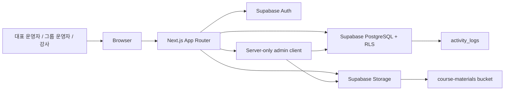

# DURE Architecture

이 문서는 현재 코드와 migration을 기준으로 DURE의 기술 구조를 설명한다. 용어 기준은 `context.md`, 페이지별 query/action 계약은 `api-spec.md`를 따른다.

## 1. 설계 원칙

- 워크스페이스를 최상위 테넌트 경계로 둔다.
- 참여자는 로그인 사용자가 아니라 운영 대상 데이터로만 다룬다.
- 대표 운영자, 그룹 운영자, 강사의 권한 차이를 서버 서비스 계층과 Supabase RLS 양쪽에서 검증한다.
- 클라이언트에서 전달한 `workspace_id`, `role`, `user_id`는 신뢰하지 않는다.
- 페이지는 업무 테이블을 직접 흩어 조회하지 않고 `src/services/`의 query/action을 호출한다.
- 기록 보존이 필요한 도메인은 물리 삭제보다 상태 변경, snapshot 필드, soft delete를 우선한다.
- RLS가 SSR 환경에서 `current_member_id(workspace_id)` 비교를 안정적으로 통과하지 않는 작업은 admin client를 사용하되, service 계층에서 먼저 권한을 검증한다.

## 2. 전체 시스템 구조



### 구성 요소

| 영역 | 책임 |
| --- | --- |
| Next.js | App Router, 서버 컴포넌트, 서버 액션, Route Handler, UI 렌더링 |
| Supabase Auth | 로그인, 회원가입, 매직 링크 초대, callback code exchange |
| PostgreSQL | 워크스페이스, 그룹, 참여자, 수업, 회차, 자료, 출석, 메모, 활동 로그 저장. 종료된 정산·피드백 행은 보존 |
| Supabase RLS | 워크스페이스 격리와 역할별 접근 제한 |
| Supabase Storage | 수업 자료 저장. 종료된 정산 영수증 객체는 보존 |
| Admin client | RLS 우회가 필요한 서버 전용 작업, Auth admin, storage upload/remove, signed URL 생성 |

## 3. 기술 스택

| 계층 | 선택 |
| --- | --- |
| Frontend/Backend | Next.js 15 App Router, React 19, TypeScript |
| Styling | Tailwind CSS v4 |
| Auth/DB/Storage | Supabase |
| Validation | Zod |
| Date/Time | date-fns |

## 4. 현재 프론트엔드 구조

실제 라우트는 `src/app` 기준으로 다음 구조를 따른다.

```text
src/app/
  page.tsx                                      # 로그인 진입/운영 안내 랜딩
  (auth)/
    login/
    signup/
    accept-invite/
  auth/callback/route.ts                        # Supabase code exchange 후 next 이동
  workspaces/
    page.tsx                                    # 내 워크스페이스 목록
    new/                                        # 워크스페이스 생성
    discover/                                   # 참여 요청 가능한 워크스페이스 탐색
    [workspaceId]/(dashboard)/
      layout.tsx
      home/
      calendar/
      members/                                  # 멤버 초대, 수정, 참여 요청 승인/거절
      manage/
        groups/
        courses/
          new/
          [courseId]/edit/
        participants/
      courses/[courseId]/                       # 운영자용 수업 상세
        home/
        materials/
        participants/
      teach/courses/[courseId]/                 # 강사용 수업 콘솔
        home/
        materials/
        attendance/
        notes/
  api/
    invites/[token]/accept/route.ts
    materials/upload-url/route.ts               # 사용 중단, 410
    materials/[materialId]/download/route.ts
```

### 화면 책임

- `/`: 비로그인 사용자를 위한 운영 안내 랜딩. 로그인 사용자는 `/workspaces`로 이동한다.
- `/workspaces`: 로그인 사용자의 워크스페이스 목록.
- `/workspaces/new`: 새 워크스페이스 생성.
- `/workspaces/discover`: 기존 워크스페이스 참여 요청.
- `/home`: 운영자는 전체 수업, 강사는 담당 수업 중심의 홈.
- `/calendar`: 수업 회차와 일반 일정의 월간 캘린더.
- `/members`: owner_admin 전용 멤버 초대/수정/제거와 참여 요청 처리.
- `/manage/groups`, `/manage/courses`, `/manage/participants`: 운영 데이터 관리 허브.
- `/courses/[courseId]/*`: 운영자용 수업 상세, 자료, 참여자 현황.
- `/teach/courses/[courseId]/*`: 강사용 수업 홈, 자료, 출석부, 메모.

### 클라이언트/서버 경계

- 서버 컴포넌트는 서비스 함수를 호출해 초기 데이터와 권한 상태를 만든다.
- 클라이언트 컴포넌트는 폼 상태, 모달, 탭, 캘린더 조작, 파일 선택, toast에 집중한다.
- 생성/수정/삭제성 동작은 `src/services/`의 server action 또는 Route Handler에서 처리한다.
- 권한에 따른 버튼 노출은 UX 보조이며, service 계층에서 같은 권한을 다시 검증한다.

## 5. 서버 모듈 구조

```text
src/
  lib/
    api/                 # 공통 ApiResult, 오류 코드, 라벨, DTO 타입
    auth/                # 사용자/워크스페이스 권한 헬퍼
    courses/             # 반복 회차 생성 유틸
    invites/             # 초대 token/hash 유틸
    supabase/            # client, server, admin client
    validators/          # Zod schema
  services/
   access.ts
   activity.ts
    attendance-dashboard-logic.ts
    attendance-dashboard.ts
   auth.ts
    calendar.ts
    class-memos.ts
    course-detail.ts
    course-participants.ts
    course-sessions.ts
    courses.ts
    groups.ts
    instructor-course.ts
    invites.ts
    join-requests.ts
    materials.ts
    participants.ts
    workspace-members.ts
    workspaces.ts
```

### 처리 원칙

- 페이지는 `services/` 계층의 query/action을 호출한다.
- 서비스 함수는 현재 사용자와 활성 멤버십을 기준으로 권한을 계산한다.
- `createSupabaseServerClient()`는 사용자 세션과 RLS가 필요한 일반 조회에 사용한다.
- `createSupabaseAdminClient()`는 admin 작업, storage 파일 조작, Auth admin, SSR/RLS 충돌 우회 작업에만 사용한다.
- admin client 사용 지점은 호출 전에 service 계층에서 권한을 검증해야 한다.
- 응답은 화면에 필요한 projection DTO를 반환하고, 내부 DB row 전체를 그대로 노출하지 않는다.

## 6. 데이터 모델

워크스페이스 하위 업무 테이블은 기본적으로 `workspace_id`를 가진다. 조인 테이블에도 `workspace_id`를 중복 저장해 RLS와 composite FK를 단순하게 유지한다.

### 핵심 테이블

| 테이블 | 설명 |
| --- | --- |
| `workspaces` | 최상위 운영 공간 |
| `workspace_members` | owner_admin, group_admin, instructor 멤버십. 초대 대기 멤버는 `user_id = null` 가능 |
| `workspace_member_groups` | group_admin 접근 그룹 |
| `workspace_join_requests` | 사용자가 기존 워크스페이스에 참여 요청한 기록 |
| `groups` | 권한 스코프이자 운영 단위 |
| `participants` | 로그인하지 않는 참여자 마스터 |
| `participant_groups` | 참여자와 그룹의 N:M 관계 |
| `courses` | 수업 기본 정보, 상태, 담당 강사, 카드 시각 정보 |
| `course_recurrence_rules` | 반복 회차 생성 규칙 |
| `course_groups` | 수업과 그룹의 N:M 관계 |
| `course_participants` | 명시 제외와 출석 FK 보호용 수업-참여자 연결 |
| `course_participant_groups` | legacy 성격의 수업 내 참여 그룹 snapshot |
| `course_sessions` | 회차, 노출/집계/진행 상태, 취소 사유 |
| `materials` | 수업 자료 메타데이터와 storage path |
| `general_schedule_items` | 일반 일정 |
| `general_schedule_item_groups` | 일반 일정 공개 그룹 |
| `attendance_records` | 회차별 참여자 출석 기록 |
| `class_memos` | 회차별 수업 메모 |
| `invites` | 멤버 초대 token hash와 수락 상태 |
| `invite_groups` | group_admin 초대 시 접근 그룹 |
| `invite_courses` | instructor 초대 시 담당 수업 사전 배정 |
| `activity_logs` | 헤더 최근 활동 원천 이벤트 |
| `instructor_payout_accounts` | 레거시 정산 계좌 데이터 (앱 기능 종료, 행 보존) |
| `settlement_requests` | 레거시 정산 요청 데이터 (앱 기능 종료, 행 보존) |
| `settlement_request_items` | 레거시 정산 품목 데이터 (앱 기능 종료, 행 보존) |
| `settlement_request_receipts` | 레거시 정산 영수증 데이터 (앱 기능 종료, 객체 보존) |
| `course_feedbacks` | 레거시 공개 수업 피드백 데이터 (앱 기능 종료, 행 보존) |
| `ontology_action_proposals` | 결정론적 운영 신호에서 생성된 human-approved action 제안 ledger |
| `ontology_action_executions` | 승인된 action의 실행 결과와 before/after audit ledger |

### 주요 enum

- `workspace_role`: `owner_admin`, `group_admin`, `instructor`
- `member_status`: `active`, `invited`, `disabled`, `removed`
- `group_status`: `active`, `inactive`
- `participant_status`: `active`, `inactive`, `deleted`
- `participant_group_status`: `active`, `removed`
- `course_participant_status`: `active`, `excluded`
- `course_status`: `planned`, `in_progress`, `completed`
- `session_type`: `regular`, `makeup`, `special`, `practice`
- `session_visibility_status`: `visible`, `hidden`
- `session_rollup_status`: `included`, `excluded`
- `session_progress_status`: `scheduled`, `cancelled`
- `material_upload_status`: `uploading`, `uploaded`, `failed`
- `material_review_status`: `pending`, `reviewed`
- `material_visibility_scope`: `admin_only` (기존 `public` 행은 기능 종료 migration에서 정리)
- `attendance_status`: `present`, `partial`, `absent`
- `settlement_request_status`: `pending`, `paid` (보존 데이터 전용)
- `course_feedback_category`: `suggestion`, `praise`, `other` (보존 데이터 전용)
- `course_feedback_status`: `new`, `reviewed` (보존 데이터 전용)
- `ontology_action_proposal_status`: `pending`, `approved`, `rejected`, `expired`
- `ontology_action_execution_status`: `succeeded`, `failed`

### 참여자 수와 출석 대상

제품 기준과 일반 수업·출석 서비스는 수업 참여 범위를 수업의 현재 연결 그룹과 참여자의 현재 활성 그룹 관계에서 파생한다. 구현별 미준수 사항은 `docs/STATUS.md`의 blocker에서 관리한다.

- 그룹 인원 수: `participant_groups.status='active'` AND `participants.deleted_at IS NULL`인 distinct participant.
- 수업 참여자 수: 수업의 현재 `course_groups`에 속한 distinct 활성 participant.
- 출석 대상과 운영자 참여자 현황도 같은 그룹 파생 기준을 쓴다.
- `course_participants.status='excluded'`는 특정 참여자를 수업에서 명시 제외하는 기록으로 사용한다.
- `course_participant_groups`는 legacy/snapshot 성격으로 보존하며, 현재 목록/집계의 주 기준이 아니다.

### 자료 접근 범위

자료는 권한 있는 워크스페이스 멤버만 접근한다. 기존 `public` 행은 기능 종료 migration에서 `admin_only`로 정리하며, 공개 수업 상세·비로그인 다운로드 경로는 제공하지 않는다.
- 과거 설계의 `material_groups`와 `selected_groups` 방식은 `20260517100000_material_visibility_v2.sql`에서 제거됐다.
- 자료 파일은 `course-materials` private bucket에 저장하고, 다운로드는 권한 검증 후 signed URL로 발급한다.

### 초대와 참여 요청

- owner_admin이 초대하면 `workspace_members` placeholder와 `invites` row를 만들고, Supabase Auth admin `generateLink`로 magic/invite link를 발급한다.
- 초대 수락은 기존 placeholder의 `user_id`를 채우고 `status='active'`로 전환한다.
- 사용자가 직접 워크스페이스 참여를 요청하면 `workspace_join_requests`에 pending row를 만들고, owner_admin 승인 시 멤버십을 생성한다.

### 종료된 정산과 피드백 데이터

정산 요청과 공개 수업 피드백은 2026-09-02 앱 기능을 종료했다. 기존 테이블·행·Storage 객체는 보존하며, 새 앱 화면·서비스·활동 DTO·정산 RLS/Storage 정책은 제공하지 않는다. 보존 데이터의 장기 삭제·열람 정책은 별도 운영 결정으로 남긴다.

## 7. API와 Route Handler 구조

Next.js Server Actions를 기본으로 사용하고, HTTP 엔드포인트가 필요한 흐름만 Route Handler로 둔다.

| 경로 | 메서드 | 상태 |
| --- | --- | --- |
| `/api/invites/[token]/accept` | `POST` | 초대 수락 |
| `/api/materials/[materialId]/download` | `GET` | 권한 검증 후 자료 signed download URL 발급 |
| `/api/materials/upload-url` | `POST` | 사용 중단. 410 `DEPRECATED` 응답 |

자료 업로드는 Route Handler signed upload URL 흐름이 아니라 `src/services/materials.ts`의 `uploadMaterial(workspaceId, courseId, formData)` server action으로 처리한다.

## 8. 인증/권한 설계

### 역할

| 역할 | 권한 범위 |
| --- | --- |
| 대표 운영자 | 워크스페이스 전체 운영 데이터 접근, 그룹/수업/참여자/사용자 관리 |
| 그룹 운영자 | 지정된 그룹 범위의 수업, 참여자, 자료, 일정, 기록 접근 |
| 강사 | 직접 배정된 수업의 자료, 출석, 메모 관리 |
| 참여자 | 로그인 사용자 아님. 시스템 권한 없음 |

### 권한 판정 규칙

- 대표 운영자는 `workspace_members.role = owner_admin`이고 `status = active`일 때 워크스페이스 전체를 볼 수 있다.
- 그룹 운영자는 `workspace_member_groups`로 지정된 그룹 범위만 접근한다.
- 그룹 운영자가 수업 전체를 수정하려면 수업의 모든 연결 그룹이 자신의 접근 그룹 안에 있어야 한다.
- 강사는 `courses.instructor_member_id`가 자신의 활성 멤버십 ID와 일치하는 수업만 접근한다.
- 일반 일정은 대표 운영자와 공개 그룹에 접근 가능한 그룹 운영자만 볼 수 있다. 강사는 일반 일정을 보지 않는다.
- 마지막 활성 owner_admin은 역할 변경, 비활성화, 제거할 수 없다.
- 멤버 제거는 `status='removed'`로 처리하며, 같은 email/user의 재초대를 막지 않도록 partial unique index를 사용한다.

## 9. RLS와 Admin Client 사용

Supabase RLS는 업무 테이블에 활성화되어 있다. 단, 현재 구현은 다음 작업에서 admin client를 사용한다.

- 자료 메타데이터 INSERT/UPDATE/DELETE, storage upload/remove, signed URL 생성
- 출석 기록과 수업 메모 upsert
- 멤버 초대, 수정, 제거, 초대 수락
- 초대, 초대-그룹, 초대-수업 row 생성/조회/수정
- 워크스페이스 참여 요청 생성/승인/거절
- 활동 로그 INSERT/SELECT와 권한 필터링 projection
- 일반 일정 생성/수정/삭제
- `attendance-dashboard.ts`는 활성 멤버십과 역할별 수업 범위를 확인한 뒤 출석 대시보드에 필요한 회차·참여자·출석 기록만 permission-scoped projection으로 집계한다.
- `attendance-dashboard-logic.ts`는 날짜/시간대, 유효 회차, `출석/유효회차`, 50% 미만 저출석 판정을 순수 함수로 계산한다.

이 패턴의 전제는 항상 같다.

1. 사용자의 Supabase 세션을 확인한다.
2. 활성 `workspace_members` row를 조회한다.
3. role, 접근 그룹, 담당 수업, 대상 row의 workspace를 검증한다.
4. 검증 후 admin client로 필요한 DB/storage 작업을 수행한다.

## 10. 파일 저장 구조

### 수업 자료

Bucket: `course-materials`

```text
workspaces/{workspace_id}/courses/{course_id}/materials/{material_id}/{file_id}-{safe_filename}
```

현재 업로드 흐름:

1. `uploadMaterial(workspaceId, courseId, formData)` 호출.
2. 서버에서 파일 크기, 확장자와 권한을 검증하고 워크스페이스 멤버 전용으로 저장.
3. admin client로 `materials` row 생성.
4. admin storage client로 파일 업로드.
5. `upload_status='uploaded'`로 갱신.
6. 실패 시 가능한 범위에서 row/file을 best-effort rollback.

`replaceMaterialFile`도 같은 server action + admin storage 흐름을 사용한다. 클라이언트 PUT signed upload URL 흐름은 사용하지 않는다.

### 종료된 정산 영수증 객체

기존 정산 영수증은 기록 보존을 위해 `settlement_request_receipts.storage_path`와 Storage 객체를 유지한다. 현재 앱은 해당 객체를 업로드·조회·다운로드하지 않는다.

```text
workspaces/{workspace_id}/settlements/{request_id}/{file_id}-{safe_filename}
```

## 11. 배포와 환경 변수

| 이름 | 사용 위치 | 설명 |
| --- | --- | --- |
| `NEXT_PUBLIC_SUPABASE_URL` | client/server | Supabase project URL |
| `NEXT_PUBLIC_SUPABASE_ANON_KEY` | client/server | RLS가 적용되는 anon key |
| `SUPABASE_SERVICE_ROLE_KEY` | server only | admin client, Auth admin, storage 작업 |
| `SUPABASE_JWT_SECRET` | server only | 필요한 경우 토큰 검증 |
| `APP_URL` | server | 초대 magic link redirect 기준 URL |
| `CRON_SECRET` | server | cron endpoint 보호용. cron 구현 시 사용 |

`SUPABASE_SERVICE_ROLE_KEY`는 반드시 service_role key여야 한다. anon key를 잘못 넣으면 자료 업로드, 초대 링크 생성, signed URL 발급 같은 admin 작업이 실패한다.

## 12. 보안 고려사항

- 모든 업무 테이블은 RLS를 기본으로 둔다.
- admin client는 서버 전용 모듈에서만 import한다.
- 초대 토큰은 원문을 저장하지 않고 hash만 저장한다.
- 자료 다운로드는 private bucket과 짧은 만료 signed URL을 사용한다.
- 현재 공개 카탈로그 DTO는 제공하지 않는다. 운영 DTO에도 참여자, 출석, 수업 메모, storage path, 원본 파일명, 멤버 email/id를 불필요하게 포함하지 않는다.
- 활동 로그는 조회 시 현재 멤버 권한으로 필터링한다.
- 파일 업로드 전 확장자, MIME type, 크기를 서버에서 검증한다.
- `.env.local`과 service role key는 저장소에 커밋하지 않는다.

## 13. 주기 작업

현재 저장소에는 cron Route Handler가 구현되어 있지 않다. 후속 구현 후보는 다음과 같다.

| 작업 | 처리 |
| --- | --- |
| 수업 상태 자동 완료 | 마지막 유효 회차 종료 시간이 지난 `in_progress` 수업을 `completed`로 전환 |
| 만료 초대 정리 | 만료된 미사용 초대와 필요 시 placeholder 상태 정리 |
| 활동 로그 보존 | 오래된 활동 로그 보존 기간 정책 적용 |

구현 위치는 `/api/cron/*` Route Handler와 Vercel Cron을 기본 후보로 둔다.
